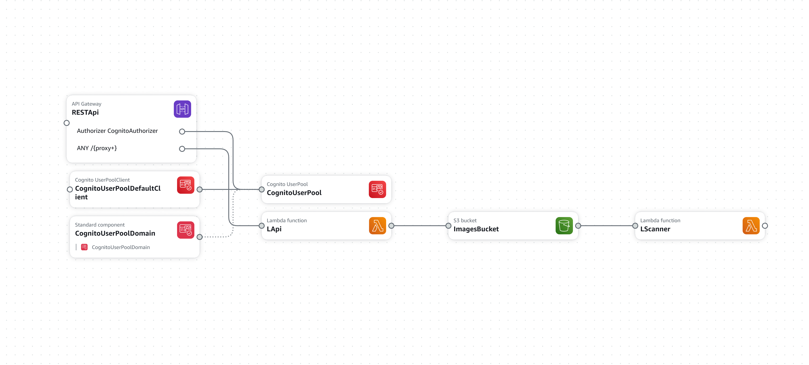

# receipt-scan-serverless
This is a serverless application that uses AWS Lambda, S3, and Textract to scan a receipt image and extract the text from it. The extracted text is then stored in MySQL database.

## Architecture


- Application exposes an API Gateway endpoint to manipulate receipts and categories.
- Authentication to the API is done using AWS Cognito User Pool.
- Eventually user can request a url for uploading a receipt image. The image is uploaded to S3 bucket.
- S3 bucket triggers a Lambda function to extract text from the image using Textract.
- Further receipt is categorized by AI model from Bedrock.
- Extracted text and category are stored in MySQL database.

## Setup
Even though deployment uses SAM CLI, the build process is managed by CMake. So you first build the project using CMake which generates deployment template and artifacts and then deploy the project using SAM CLI.
1. Make sure you have CMake, AWS CLI and SAM CLI installed.
2. Make sure you have a valid toolchain for compiling against AWS ARM64 Lambda runtime.
3. Create a build directory
```bash
mkdir out
cd out
```
4. Run CMake, replace `<path-to-aws-toolchain-file>` with the path to the toolchain file.
```bash
cmake .. -DCMAKE_BUILD_TYPE=Release -DCMAKE_TOOLCHAIN_FILE=<path-to-aws-toolchain-file>
```
5. Build the project
```bash
cmake --build .
```
6. Deploy the project, replace `<stage>` with the stage you want to deploy to.
```bash
./deploy <stage>
```
7. Setup database. Execute all the scripts in `database` directory in MySQL database.
8. Bedrock model does not make part of cloudformation stack. You need to deploy it manually. This project uses `Claude Instant 1.2` model.
9. Configure connection to MySQL database in Systems Manager Parameter Store. Create a parameter with name `/receipt-scan/<stage>/db-connection-string` and value as connection string to MySQL database.

## Authenticating with API
1. Navigate to the created Cognito User Pool in AWS Console.
2. Create a new user.
3. Go to `App Integration`.
4. Find your `Cognito domain`. This is the domain you will use to authenticate with the API.
5. Navigate to `App clients` and find the `Client id` of `receipt-scan-<stage>-user-pool-client`. This is the default user pool client created by the project.
6. Browse url `https://<cognito-domain>/login?response_type=code&client_id=<client-id>&redirect_uri=https://localhost:4200`. Replace `<cognito-domain>` and `<client-id>` with your values. After successful login you will be redirected to the indicated page with a `code` in the url.
7. With postman or curl or any other tool, make a POST request to `https://<cognito-domain>/oauth2/token` with `x-www-form-urlencoded` body providing values `grant_type=authorization_code`, `client_id=<client-id>`, `code=<code>` and `redirect_uri=https://localhost:4200`. Replace `<client-id>` and `<code>` with your values. The endpoint will exchange the code for an `access_token`.
8. Now to make requests to the application API you need to provide the `access_token` in the `Authorization` header (without `Bearer`).

## API
### User
- `POST /user` - Init a new user. Only id is taken from `access_token`. No body required. Returns `200` if successful. Noop if user already exists.

### File
- `POST /file` - Get a pre-signed url to upload a receipt image. Returns `200` with url.

### Receipt
- `GET /receipts` - Get all receipts. Returns `200` with list of receipts.
- `GET /receipts/{id}` - Get a receipt by id. Returns `200` with receipt.
- `PUT /receipts` - Add a new receipt or update an existing one. This endpoint permits to modify manually receipt information, or even add a totally manually inserted receipt. Returns `200` if successful.
- `DELETE /receipts/{id}` - Delete a receipt by id. Returns `200` if successful.
- `GET /receipts/{if}/file` - Get a pre-signed url to obtain the receipt image. Returns `200` with url.

### Category
- `GET /categories` - Get all categories. Returns `200` with list of categories.
- `PUT /categories` - Add a new category or update an existing one. Returns `200` if successful.
- `DELETE /categories/{id}` - Delete a category by id. Returns `200` if successful.
